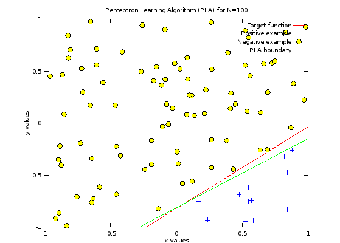

# Code For Week #1

The main aspect of this homework is the implementation of a simple model called
Perceptron Learning Algorithm (PLA).

There's also code to answer a few other questions about probability.

## Plots

This is a sample plot that shows the difference between the target function
![f][f] and the hypothesis ![g][g] found via PLA on 100 random points uniformly
distributed between ![-1, 1][interval]

[f]: http://latex.codecogs.com/gif.latex?f
[g]: http://latex.codecogs.com/gif.latex?g
[interval]: http://latex.codecogs.com/gif.latex?%5B-1%2C1%5D
